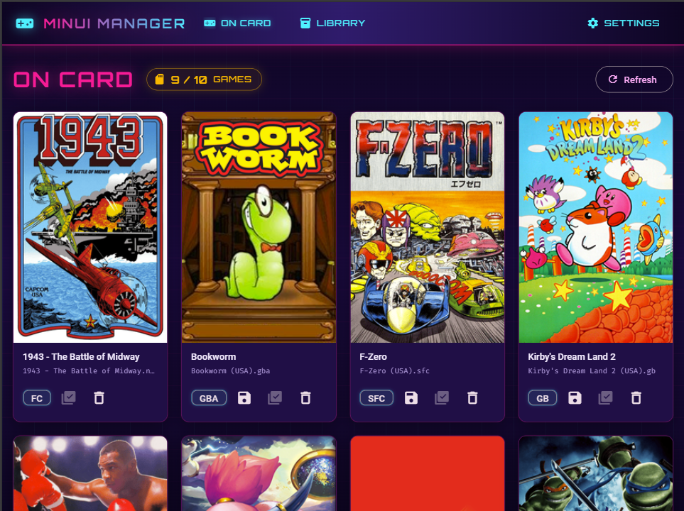
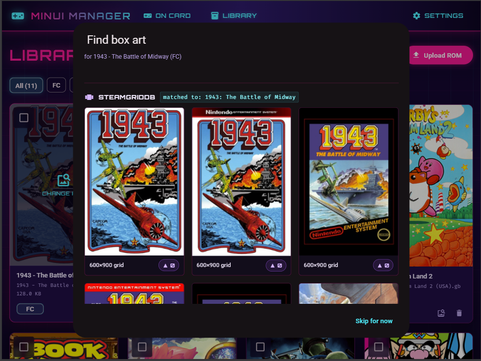
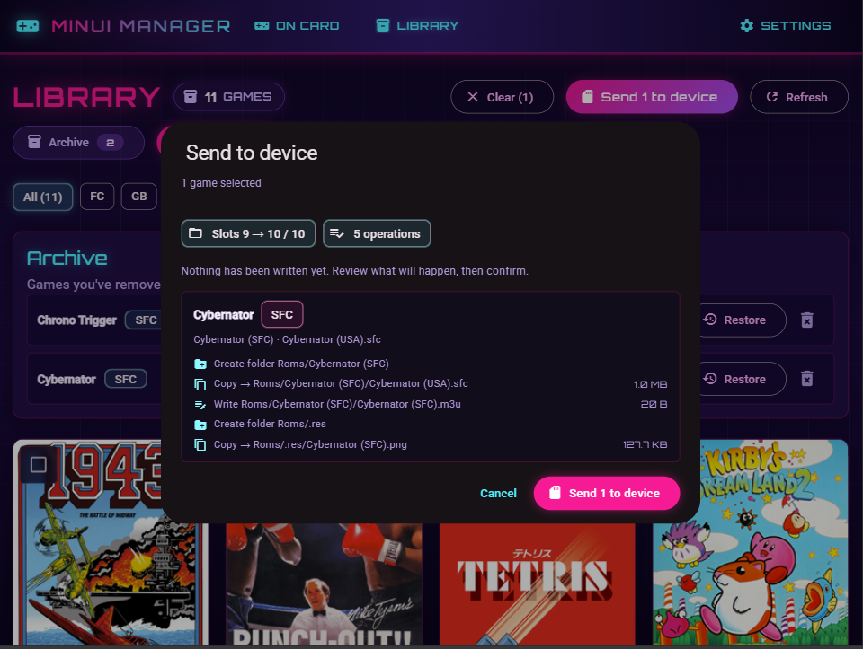
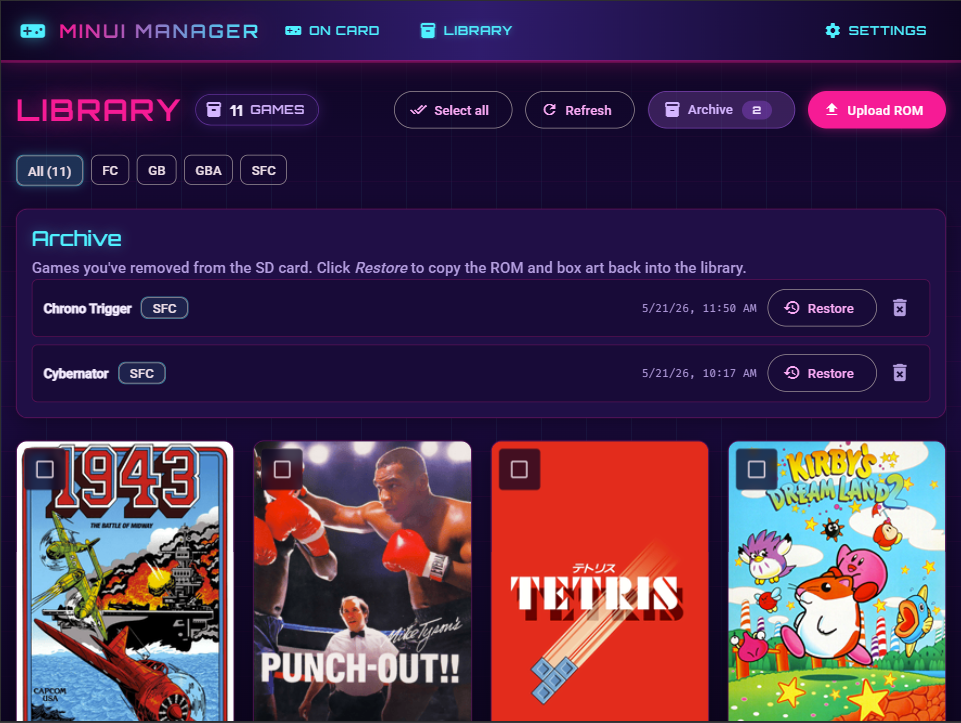

# MinUI Game Manager

A local web app for curating a small, focused game library on a Miyoo Mini Plus
running [MinUI](https://github.com/shauninman/MinUI) in the **Five Game Handheld**
(Game View) layout. Upload a ROM, auto-detect its system, find and resize box
art, write everything to the SD card in the exact layout MinUI expects, and
swap games in and out without breaking saves or art.

The SD card is treated as a destination, not as storage — the durable library
and the archive of removed games live on the laptop, so swapping back to a
previous game is one click and saves come along for the ride.

> Single-user, runs locally, opinionated for a Windows host. See
> [`minui-game-manager-plan.md`](./minui-game-manager-plan.md) for the full
> design doc.

## Features

- **SD card dashboard** — live grid of what's currently on the card, with box
  art, system code, save indicator, malformed-game indicator, and a slot
  counter (e.g. "9 / 10").
- **Library** — uploaded ROMs not currently on the card, with auto-detected
  system (parenthesized code → extension → preferred extension fallback) and
  an editable display name.
- **Multi-disk uploads** — drag a whole game folder (or pick the discs + the
  `.m3u` together) and the app treats it as one library entry. PS1 discs land
  in a per-game folder with the `.m3u` regenerated alongside them; sync writes
  every disc plus a fresh multi-line `.m3u` so MinUI's in-game disc swap works.
- **Import from card** — pulls a game that's already on the SD card back into
  the library in one click (ROM + box art, every disc for multi-disk games).
  Lets you backfill the library from a card you assembled by hand. Games
  already represented in the library show as "Already in library" instead of
  offering the action.
- **Box art lookup** — primary source is
  [libretro-thumbnails](https://github.com/libretro-thumbnails); fuzzy-matches
  the ROM filename and ranks the top candidates. Optional SteamGridDB as a
  secondary source if you supply an API key. As a third option, upload your
  own image when neither source has what you want.
- **Image processing** — every box art (lookup result or user upload) is
  normalized to a 200×300 PNG (cover / contain / stretch — configurable)
  before it reaches the card.
- **Send to device** — dry-run preview, then a single atomic copy that writes
  the ROM, the `.m3u`, and the box art into the exact MinUI Five-Game layout.
- **Remove with archive** — removing a game from the card moves the ROM, the
  `.m3u`, the box art, and any save (both `<game>.m3u.sav` and legacy
  `<rom>.sav` patterns) into `./data/archive/<CODE>/<game>/<timestamp>/`.
  Restore to the library in one click.
- **Library backup** — export the entire library as a zip; re-import a zip on a
  fresh machine.
- **Safety rail** — all SD-card writes go through a `SafeSDCardWriter` that
  refuses any path outside `Roms/` and `Saves/<CODE>/`, and refuses path
  traversal. The card's `.system/`, `.userdata/`, `Bios/`, `Emus/`,
  `Roms_systems/`, and root files are never touched.

## Screenshots

<table>
  <tr>
    <td width="50%" align="center">
      <a href="./examples/on-card.png"></a><br />
      <sub><strong>On Card</strong> — the live SD card dashboard. Each tile is one game with its box art, system code, save indicator, and per-game import / remove actions. The header chip shows the slot counter.</sub>
    </td>
    <td width="50%" align="center">
      <a href="./examples/find-boxart.png"></a><br />
      <sub><strong>Find box art</strong> — fuzzy-matched candidates from <a href="https://github.com/libretro-thumbnails">libretro-thumbnails</a> (and optionally SteamGridDB), plus an upload-your-own fallback. Click one to preview; the app normalizes it to 200×300 PNG before saving.</sub>
    </td>
  </tr>
  <tr>
    <td width="50%" align="center">
      <a href="./examples/send-to-device.png"></a><br />
      <sub><strong>Send to device</strong> — pick which library games to push, see the exact <code>mkdir</code> / <code>copy</code> / <code>write</code> operations the writer will run, then confirm to execute. Nothing touches the card until you click through.</sub>
    </td>
    <td width="50%" align="center">
      <a href="./examples/archive.png"></a><br />
      <sub><strong>Archive</strong> — every game removed from the card lands here with its ROM, art, and save bundled in a timestamped folder. <em>Restore</em> copies it back to the library; the trash icon deletes a stale snapshot.</sub>
    </td>
  </tr>
</table>

## Why this exists

The Five Game Handheld layout looks great on the device but is fiddly to set up
by hand. Each game needs its own `<Display Name> (CODE)` folder under `Roms/`,
a `.m3u` whose basename matches the folder (saves are bound to it), and a
shared `Roms/.res/<Display Name> (CODE).png` at exactly 200×300. Getting any of
that slightly wrong silently breaks saves or box art. This app makes the
filesystem contract a backend invariant instead of a manual checklist.

## Requirements

- Windows 10/11 (the `make.ps1` task runner assumes PowerShell; the bare
  `Makefile` works on POSIX but isn't the primary path).
- Python 3.10+.
- Node 20+. The `make.ps1` script expects Node at `C:\nodejs\` — adjust the
  `Use-Node` function near the top of `make.ps1` if yours lives elsewhere.
- A Miyoo Mini Plus with MinUI BASE + EXTRAS installed, configured for the
  Five Game Handheld / Game View layout, with its SD card plugged into the
  host machine.

## Setup

One-time install (creates `.venv`, installs Python deps + Angular deps):

```powershell
.\make.ps1 install
```

## Run

```powershell
.\make.ps1 run
```

That's it. The script builds the frontend bundle on first run (one-time cost
of ~30s), starts FastAPI on `:8000` serving both the API and the built UI, and
opens <http://localhost:8000> in your browser. `Ctrl-C` stops the server.

First-time use: open **Settings**, point it at your SD card root (e.g. `D:\`)
using the native folder picker, and confirm the status reads `ok`. Optionally
paste a SteamGridDB API key if you want it as a secondary box-art source.

### Dev mode (editing the UI)

When you're actively changing the Angular code and want hot reload, run the
backend and the Angular dev server in two terminals:

```powershell
# terminal 1 — FastAPI backend on :8000
.\make.ps1 backend

# terminal 2 — Angular dev server on :4200 (proxies /api → :8000, hot reload)
.\make.ps1 frontend
```

Then open <http://localhost:4200>. Backend OpenAPI docs are always at
<http://localhost:8000/docs>.

### Rebuilding the bundle

`run` only builds the frontend the first time. After pulling UI changes from
git, rebuild explicitly:

```powershell
.\make.ps1 build
```

## Test

```powershell
.\make.ps1 test          # backend pytest suite
.\make.ps1 build         # frontend production build (smoke test)
.\make.ps1 lint          # ruff
.\make.ps1 fmt           # ruff format
```

## SD card layout (target)

The full filesystem contract is in
[`minui-game-manager-plan.md`](./minui-game-manager-plan.md) §4. Short version:

```
<SD_ROOT>/
├── .system/, Emus/                        # presence of both = "valid" SD card
├── Roms/
│   ├── .res/
│   │   ├── Tetris (FC).png                # one PNG per game, 200×300
│   │   └── Kirby's Dream Land 2 (GB).png  # named after the GAME FOLDER, not the ROM
│   ├── Tetris (FC)/
│   │   ├── Tetris.nes
│   │   └── Tetris (FC).m3u                # one line: the ROM filename
│   ├── Lunar - Silver Star Story (PS)/    # multi-disk: every disc + a
│   │   ├── Lunar Disc 1.chd               #   multi-line .m3u driving
│   │   ├── Lunar Disc 2.chd               #   MinUI's in-game swap
│   │   └── Lunar - Silver Star Story (PS).m3u
│   └── ...
├── Saves/<CODE>/<game-folder>.m3u.sav     # saves are bound to the .m3u basename
└── (everything else is left untouched)
```

Supported systems (codes from the reference card): FC, GB, GBA, GBC, GG, MD,
MGBA, NGP, NGPC, P8, PCE, PKM, PS, SFC, SGB, SMS, SUPA, VB. See
[`backend/app/systems.yaml`](./backend/app/systems.yaml) to add or tweak.

## Project layout

```
minui-manager/
├── backend/                      FastAPI app + pytest suite
│   ├── app/
│   │   ├── main.py
│   │   ├── config.py             Settings model + JSON persistence
│   │   ├── paths.py              project-local ./data/ paths
│   │   ├── systems.yaml          system metadata + extension preferences
│   │   ├── routers/              sdcard, library, boxart, archive, settings
│   │   └── services/             validator, reader, writer, sync, remover,
│   │                             system_detector, library_store, archive_store,
│   │                             boxart_libretro, boxart_steamgriddb,
│   │                             image_processor, library_backup, folder_picker
│   └── tests/                    20 test modules covering the above
├── frontend/                     Angular 19 + Material (synthwave theme)
│   └── src/app/
│       ├── pages/                games, library, settings
│       └── services/             typed API clients
├── scripts/
├── data/                         user settings, library, archive (gitignored)
├── make.ps1                      PowerShell task runner
├── Makefile                      POSIX equivalent
├── pyproject.toml
└── minui-game-manager-plan.md    full design doc
```

`./data/` holds everything user-specific — uploaded ROMs, cached box art,
archived games, `config.json`, `app.db`, and `sync.log`. It is gitignored.

## Status

Phases 1–8 of the [project plan](./minui-game-manager-plan.md) are complete:
SD card validation, library upload (single- or multi-disk), system
auto-detection, libretro and SteamGridDB box-art lookup, image normalization,
send-to-device, remove with archive + restore, and library backup/restore.
Manually verified end-to-end against a real Miyoo Mini Plus.

## Caveats

- Designed for a single user on one machine. No auth, no multi-tenancy.
- Only the Five Game Handheld layout is supported. `Roms_systems/` (the
  parallel per-system tree) is acknowledged on the card but not managed.
- BIOS files are out of scope — handle those manually.
- No network/SSH transfer to the device. The SD card has to be plugged in.

## Credits

The "Five Game Handheld" concept this app automates comes from Russ at
[Retro Game Corps](https://retrogamecorps.com/) — specifically his
[MinUI starter guide](https://retrogamecorps.com/2025/10/24/minui-starter-guide/),
which spells out the curated-grid layout, the shared `Roms/.res/` box-art
trick, and the `.m3u`-based save binding that this app encodes as filesystem
invariants. Highly recommended reading if you're new to MinUI.

The on-device experience itself is [MinUI](https://github.com/shauninman/MinUI)
by Shaun Inman, and the box-art catalog this app's primary lookup uses is
[libretro-thumbnails](https://github.com/libretro-thumbnails).
